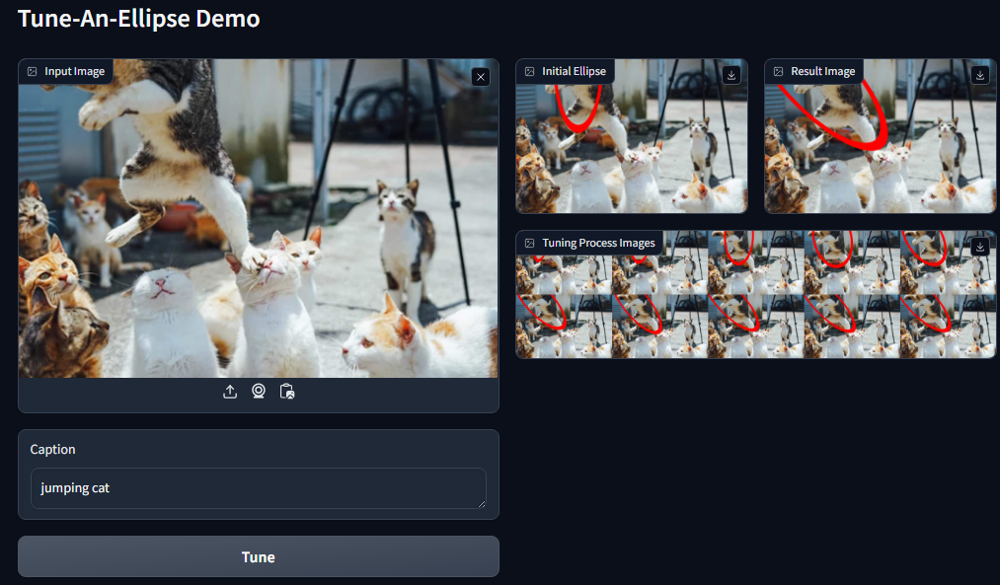

# Tune-An-Ellipse

This is the official PyTorch implementation of our paper:

> **Tune-An-Ellipse: CLIP Has Potential to Find What You Want** <br>
> CVPR 2024 Highlight <br>
> Jinheng Xie, Songhe Deng, Bing Li, Haozhe Liu, Yawen Huang, Yefeng Zheng, Jurgen Schmidhuber, Bernard Ghanem, Linlin Shen, Mike Zheng Shou <br>
> 
> [[Paper]](https://openaccess.thecvf.com/content/CVPR2024/html/Xie_Tune-An-Ellipse_CLIP_Has_Potential_to_Find_What_You_Want_CVPR_2024_paper.html) [[Poster]](https://cvpr.thecvf.com/media/PosterPDFs/CVPR%202024/30111.png?t=1717342390.8234193) [[Demo]]() 

## Install

```shell
pip install requirements.txt
```

## Demo

- The code will automatically download the clip model checkpoints

### GUI

```shell
python gradio_demo.py
```


### CLI

```shell
python run.py --img_path source/cat.png --caption "jumping cat" 
```

Result image will be saved at `workspace/test/hd_tune`


## Experiment on RefCOCO/RefCOCO+/RefCOCOg

1. Please following the instructions in [lichengunc/refer](https://github.com/lichengunc/refer?tab=readme-ov-file#download) to download the refcoco series datasets
2. After downloading all of them, organize the data as follows in `/PATH/TO/RefCOCO`,

```shell
├── images
│   └── mscoco
│       └── images
│           └── train2014
├── reclip_data
│   ├── refcoco+_dets_dict.json
│   ├── refcoco_dets_dict.json
│   └── refcocog_dets_dict.json
├── refcoco
│   ├── instances.json
│   ├── refs(google).p
│   └── refs(unc).p
├── refcoco+
│   ├── instances.json
│   └── refs(unc).p
└── refcocog
    ├── instances.json
    ├── refs(google).p
    └── refs(umd).p
```

3. Using the prepared scripts,

```shell
bash scripts/refcoco.sh
bash scripts/refcoco+.sh
bash scripts/refcocog.sh
```

---

We used the code from [CLIP-ES](https://github.com/linyq2117/CLIP-ES) to generate the cam of clip models, thanks to their great work!

# BibTex

```shell
@InProceedings{Xie_2024_CVPR,
    author    = {Xie, Jinheng and Deng, Songhe and Li, Bing and Liu, Haozhe and Huang, Yawen and Zheng, Yefeng and Schmidhuber, Jurgen and Ghanem, Bernard and Shen, Linlin and Shou, Mike Zheng},
    title     = {Tune-An-Ellipse: CLIP Has Potential to Find What You Want},
    booktitle = {Proceedings of the IEEE/CVF Conference on Computer Vision and Pattern Recognition (CVPR)},
    month     = {June},
    year      = {2024},
    pages     = {13723-13732}
}
```
